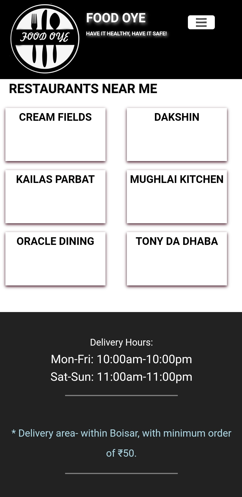
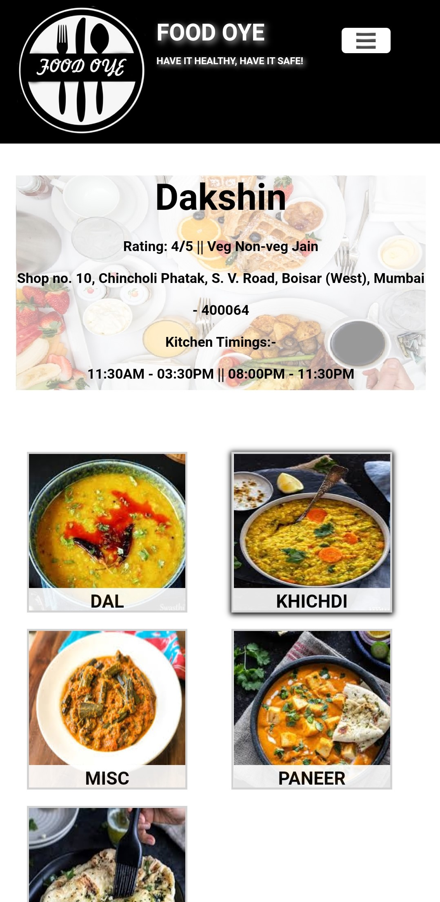
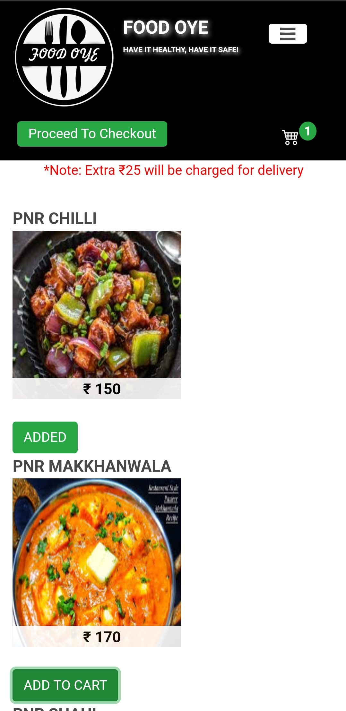
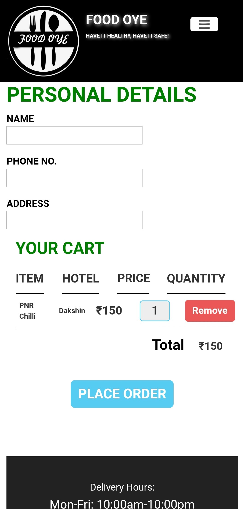

  
   
   
  🍴 <b>Food Oye</b>, a web app for ordering food. 🍴

## Technologies

- Front end
   - HTML
   - CSS (Bootstrap)
   - JS
- Back end
   - Node.js (Express.js)
   - Firebase

## Web app screenshots

:arrow_down: Home page and restaurant page
 
 
 
 
 
:arrow_down: Dishes page and checkout page
 
 
 

## Authors

- Harsh Kapadia
   - [GitHub](https://github.com/HarshKapadia2)
   - [LinkedIn](https://www.linkedin.com/in/harshgkapadia/)
   - [Twitter](https://twitter.com/harshgkapadia)
- Rajat Joshi
   - [GitHub](https://github.com/rajatrjoshi/)
   - [LinkedIn](https://www.linkedin.com/in/rajat-joshi-5a7070190/)
